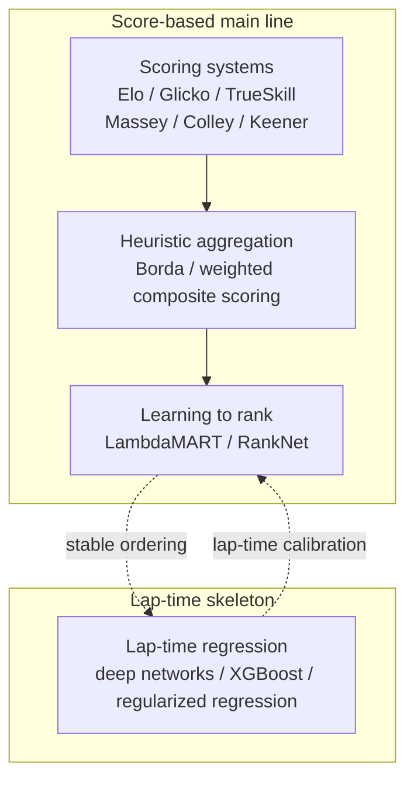

# 03 · Survey

## 3.1 The method landscape: two scanning rounds

The first round was done in the lightest possible way: we extracted metadata only from search snippets and project landing pages, with no full-text downloads. Three domain layers — F1-specific, general sports prediction, and general ranking — each covered four platform types (academic search, code hosting, general web, and video), for 60 records in total.

Two things in the results are worth recording. First, all five method paradigms (regression, scoring systems, learning to rank, probabilistic models, heuristics) appeared — every direction on this map of qualifying prediction has been walked by someone before. Second, the heuristics paradigm had only 4 records, visibly thin. This coverage gap triggered our second, targeted round: 14 new records (7 heuristics, 6 scoring systems, 1 learning to rank). The most useful insight from the second round was that "heuristics" does not only mean race-strategy simulation — fuzzy rule bases, Borda counts, weighted composite scores, and fallback logic all belong to this family, and they happen to be suitable material for small-sample baselines.

The 74 records from the two rounds combined show a clear distribution. By domain: 20 F1-specific, 20 general sports, 34 general ranking — nearly half of the transferable ranking and scoring theory comes from outside F1; even where F1-specific methods have data requirements beyond our assets, lightweight baselines remain available. By paradigm: 18 regression, 19 scoring systems, 12 learning to rank, 14 probabilistic models, 11 heuristics. The distribution itself supports one conclusion: this field has no single correct paradigm; the method space is pluralistic.

Grouped by prediction route, all the methods converge on two main lines:

The score-based side has three layers — scoring systems as the base layer, heuristic aggregation as the middle layer, learning to rank as the complex layer; the lap-time side is a regression skeleton. Bridging between the two lines is possible.

## 3.2 Deep evaluation: 45 records and gating

From the 74 records of the two rounds we screened out 45 that apply to qualifying with medium or high transferability, read the full text or the repository of each, extracted feature lists, algorithm steps, and validation approaches, and then ran a feasibility gate against our data assets.

The gating result was **41 passed, 0 pending, 4 reference-only**. The 0 pending is worth explaining: about one third of the records had been flagged "only partial data" during the first scanning round, and by the third round they had been upgraded across the board to "obtainable by processing" — raw data such as practice lap times, weather, and sector timings had long been archived locally; it just had not yet been aggregated into model-usable features. These methods are not blocked on "whether the data exists" but on "the feature pipeline not yet being built". The 4 reference-only records are all video sources: they help with understanding concepts, but cannot be treated as reproducible model specifications or empirical proof.

By route: 40 records score-based, 5 lap-time-based. This ratio does not say the score-based route is intrinsically better; it says only that its data requirements are lower — scoring systems can update to reasonable estimates on samples of a few dozen pairwise contests, which exactly matches our scale of "single digits to a dozen-odd events", while lap-time regression needs representative practice lap times, weather context, and sector features, and is sensitive to cross-circuit normalization. **The conclusion of the paradigm comparison** is therefore: the score-based route forms the ranking backbone, the lap-time route forms a conditional layer, and the two are fused under the constraint "only simultaneous improvement allows a change to the ranking" — the lap-time layer may modify the scoring model's ranking only if, in forward validation, it improves both ranking quality and lap-time error at the same time; otherwise it is treated as fitting noise on a small sample.

On the feature side we aggregated **21 recommended features** from the 45 methods, in three tiers by availability: usable for the first-version baseline (recent form — the last three events; same-circuit history; standings; track profile; component signals); usable at the learning-to-rank stage (a weekend-grouped feature matrix, group identifiers, pairwise orderings); required by the lap-time layer (practice lap times, weather, sector timings — raw data in the archive, awaiting aggregation).

We listed 5 of them as core candidates, each with a clear purpose: an industry method that bridges practice performance to qualifying[1] (a direct mapping from practice pace to qualifying order); an industry study using scoring systems to assess "who is the fastest driver"[2] (the core reference for the lap-time route); an open-source learning-to-rank baseline[3] (data requirements roughly aligned with our assets); an open-source project that models the four sessions separately, with strict temporal validation[4] (the closest match to our multi-target boundaries); and a deep-network paper on lap-time prediction[5] (its original method is not feasible — see 3.3 for the reason — but the "separate by circuit" idea was retained).

## 3.3 Source access and honest recording

Of the 45 deeply evaluated records, 7 were refused by the source website at archive time (HTTP 403). We handled them as follows: 5 were manually backfilled with full text and re-evaluated; 2 were dropped — one whose code repository had been removed and whose original content was no longer current enough, and one a scan whose photocopy quality was too poor for OCR to work.

The full-text backfills brought several updates that changed judgments, recorded one by one:

- The deep-network lap-time prediction paper[5] actually trains one small network per driver per circuit (two hidden layers, nine neurons). That is not feasible with only single-digit samples of rounds; the method was rejected, but the idea is archived.
- A sports modeling framework paper[6] argues that sports prediction must use time-series validation rather than random cross-validation — directly supporting our backtest design.
- A systematic review[7] found that **53% of ordinal regression studies in sports did not validate model assumptions** — a reminder that evaluation protocols must carry their own checks.
- A comparison study of ranking methods[8] proposed a "forward stability" analysis (measuring ranking methods with Euclidean distance and Kendall tau) that can be ported directly into our validation pipeline.
- A method that ranks teams on a graph structure[9] outperforms classical scoring methods on pair-dense competitions; but it depends on a sufficient number of pairwise meetings, and our sparse schedule is a clear application risk.

Failures, dropped items, and limitations all remain in our survey archive; nothing is deleted.

## 3.4 Implementation route: from methods to code

The fourth round was not a mandatory round in the plan — all three stopping criteria had already been answered in the third round. We added it anyway, and the motivation was direct: before starting to write code, know "what to write first". This round found 10 implementation references (4 F1 open-source projects, 2 learning-to-rank libraries, 2 data-source tools, 2 scoring baseline libraries), and from them we laid out a three-phase route:

- **P0 · A dependency-free explainable score baseline.** Implement component scoring using only the standard library (recent form, constructor strength, circuit fit, pre-event evidence, reliability — these five are the five components of the first-version model in Chapter 06, later written with short names such as form and constructor) and aggregate them with weights, then output a top ten sorted by score. The initial weights of the first version are a set of starting values; their provenance and later adjustments are covered in Chapter 06. All required data is already in place; this can be done immediately.
- **P1 · Learning to rank.** A ranking model grouped by event, built on LightGBM or XGBoost, with labels derived from result positions. This requires introducing one new dependency, so it comes after P0 validation.
- **P2 · The lap-time conditional layer.** The precondition is aggregating raw data into session-level features; it outputs predicted lap times and gaps relative to pole, and under the constraint of 3.2 it takes part in the ranking only when calibration improves both at the same time.

In the same round we also made explicit what we would not do: no introducing multiple machine-learning dependencies before baseline validation; no going straight to deep networks or telemetry-heavy models (sample size and explainability are both insufficient); no porting race-strategy heuristics directly over as the qualifying main model; no treating video or community content as reproducible evidence.

## 3.5 In-season survey: when races contradict the data

After the theoretical survey had landed and the models started running, two kinds of questions that needed empirical answers emerged mid-season, and we ran a second-phase survey for them.

The first was the tempo of change in constructor strength. We built a round-by-round event archive: upgrade packages after R03, reliability failures, rule changes (for example, wind-tunnel allocations reset by current standings), seat changes, and legal rulings, all registered one by one and cross-checked against the round-by-round points trajectories in our archive. Two conclusions were directly useful for modeling: the relative ordering of the leading group reshuffles roughly every two to three races, in step with the release cadence of upgrade packages; while a "constructor strength" feature based on historical accumulation systematically lags by about 2-3 rounds. The archive also exposed a real failure source: mid-season seat swaps move drivers in and out of the entry list, and a model that depends on the season-start list will rank drivers who are not present, making an entire round unscoreable (see Chapter 07 for details).

Second, we ran two rounds of isolated experiments on a "constructor strength correction mechanism" — the first round tested six correction variants, the second round tested a "gated" variant (enabling the correction only in designated rounds after an upgrade event) — all run alongside controls. The directions were mostly right, but the effect sizes all fell inside the noise band of ±0.006 to 0.010; one fake-event control group even showed a larger gain than the real-signal group. We ultimately ruled that the mechanism does not enter the main line; the candidate was converted to a pre-registered blind test, awaiting examination by real race weekends. The full narrative is in the decision log in Chapter 09.

## References

1. AWS Machine Learning Blog. *Predicting qualification ranking based on practice session performance for Formula 1 Grand Prix*. https://aws.amazon.com/blogs/machine-learning/predicting-qualification-ranking-based-on-practice-session-performance-for-formula-1-grand-prix/
2. AWS Machine Learning Blog. *The fastest driver in Formula 1*. https://aws.amazon.com/blogs/machine-learning/the-fastest-driver-in-formula-1/
3. francescoparra. *Formula 1 Qualifying Prediction (ML Baseline)*. GitHub. https://github.com/francescoparra/f1-ml
4. eddmann. *F1 picks 2025 predictor*. GitHub. https://github.com/eddmann/f1-picks-2025-predictor
5. *Deep Neural Network-based lap time forecasting of Formula 1 Racing*. ResearchGate. https://www.researchgate.net/publication/379012640_Deep_Neural_Network-based_lap_time_forecasting_of_Formula_1_Racing
6. *A machine learning framework for sport result prediction*. ScienceDirect. https://www.sciencedirect.com/science/article/pii/S2210832717301485
7. *Reporting of regression models for ordinal responses in sports sciences*. WIREs Computational Statistics. https://wires.onlinelibrary.wiley.com/doi/10.1002/wics.70012
8. *A Forward-Looking Approach to Compare Ranking Methods for Sports*. MDPI Information. https://www.mdpi.com/2078-2489/13/5/232
9. *Learning to Rank Sports Teams on a Graph*. MDPI Applied Sciences. https://www.mdpi.com/2076-3417/10/17/5833
