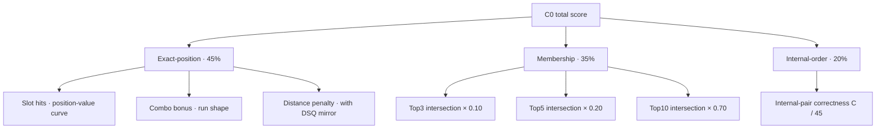
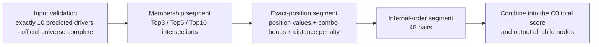

# 05 · The Scoring System

Before writing down a single parameter, this scale had to answer a harder question: what does "a good prediction list" actually mean? Every fan has an intuition for that judgment, yet nobody can write down a formula for it directly. Our approach treated the intuition as data waiting to be mined, and turned it into mathematics in three steps. Step one, interrogation: a formal questionnaire of 84 questions (plus 4 architecture interviews, 90 question-and-answer rounds in total), ranging from "which is worse, getting pole wrong or missing three drivers" to "how should a DSQ be counted", with the decision context and the verbatim wording of each call recorded for every question. Step two, a blind questionnaire: typical error patterns were turned into questions with options; the question order, option randomization, and repeated items were frozen and hashed before the questionnaire was answered, and no model scores were visible at any point while it was filled in. Step three, constraint solving: the answers were converted into machine-checkable constraints and handed to a solver, which found the set of parameters satisfying every stated preference; we then proved that this set is non-empty and reproducible by an independent program. Every weight in C0 is therefore not something tuned into place but the solution to a set of explicitly declared preferences. The rest of this chapter is the scale that this process produced.

## 5.1 Why We Need a Scale of Our Own

Many off-the-shelf metrics can be borrowed for evaluating ranking predictions, but each one used alone will mislead. List overlap only asks "how many of the ten got in" and is entirely indifferent to order; position accuracy only counts "how many positions were right" and does not distinguish an error at the head from one at the tail. Imagine two models that both hit 8 names: one gets P1–P2 wrong, so the whole head is wrong; the other gets P9–P10 wrong, a minor slip at the tail. Their value to readers and fans differs enormously, yet under a single metric they can receive the same score.

We therefore fixed one convention in the design review: ranking quality is evaluated "position by position", and all component information must be retained rather than compressed into a single score that easily comes detached from intuition. The scale has to answer three questions at once:

- **How many got in** — how much of the top-ten membership is right;
- **Whether the positions are right** — whether the name at each position actually belongs to that position;
- **Whether the order is right** — whether the ordering relations inside the list have been recovered.

The scoring system ultimately frozen is what we call C0 in this report.

## 5.2 It Began with a Breakdown

Our first design took a different path: write a simple scorer and compare positions directly. That path stalled on a real case. The official qualifying classification for R04 contained disqualified drivers — their entries were not positions but "empty position + status". Simple position comparison cannot handle this: a driver who withdrew or was disqualified should count, in the score, neither as "last place" nor as silently ignored.

Facing that breakdown, we did not patch the code; we stepped back one level: first write the scoring algorithm out in full as a specification document — a node-logic diagram and an algorithm specification, with every computation node labeled by an explicit status (confirmed, candidate, open, reserved, deferred, excluded) — so that every point of disagreement was exposed cleanly on paper before any code was written. All three components of C0 today came out of this "specification first, code second" process.

## 5.3 The Computational Specification: Three Parts, Examined One by One

This section is the complete computational specification of C0: every module comes with its inputs, formulas, parameter values, and where each parameter came from. From this section alone, every point of any prediction can be recomputed. The structure first — the total score is a weighted combination of three segments; the membership segment and the internal-order segment are each a single number, while the exact-position segment has three submodules of its own:

### Membership Segment (weight 35%)

The inputs are the predicted list and three official sets: top three, top five, and top ten. The computation:

$$ S_{\mathrm{top}k} = \frac{|P_k \cap O_k|}{k},\qquad S_{\mathrm{pool}} = 0.10\,S_{\mathrm{top3}} + 0.20\,S_{\mathrm{top5}} + 0.70\,S_{\mathrm{top10}} $$

Parameters and provenance: the three internal weights 0.10, 0.20, 0.70 come from a thought-experiment anchor — "all of Top3 right, all of Top5 right, 6 of Top10 hit" should score nearly level with "all of Top3 missed, 2 of Top5 hit, 9 of Top10 hit": fully identifying the high positions roughly cancels the advantage of hitting three extra Top10 names. In marginal terms, the value of one additional hit is 0.1433, 0.1100, and 0.0700 across the three tiers (a ratio of about 2.05 : 1.57 : 1) — the further inside the list, the more expensive the position.

### Exact-Position Segment (weight 45%)

This is the heaviest segment on the scale. It has three submodules, each computed on its own before being combined.

**Submodule one, slot hits.** The $i$-th predicted slot is compared one by one against the official $i$-th position; a hit is recorded as 1: $\mathrm{hit}_i \in \{0,1\}$. Each slot carries a position value:

$$ v(i) = 1 - 0.4\left(\frac{i-1}{9}\right)^{1.25},\qquad \sum_{i=1}^{10} v(i) \approx 8.1966 $$

Position 1 is worth 1.0, declining to 0.6 at position 10. The normalized hit score:

$$ S_{\mathrm{position}} = \frac{\sum_i v(i)\cdot \mathrm{hit}_i}{\sum_i v(i)} $$

Parameters and provenance: 0.4 is the depth of the decline and 1.25 the curvature, from one design constraint — slow decline at the top, faster at the bottom, but only a gentle bend overall: P1 matters more than P10, but not by a cliff.

**Submodule two, combo bonus.** Find every maximal consecutive-hit run in the hit vector (length at least 2; P3, P4, and P5 all hit, for example, form one run). Each run is valued by its start $s$ and length $L$:

$$ \mathrm{len}(L) = 1.5^{\,L-10},\qquad \mathrm{start}(s) = q^{\,s-1},\qquad q = (2/3)^{1/3} \approx 0.8736 $$

Length value is normalized so that a perfect ten-run equals 1, so the larger $L$ is, the closer it comes to 1; start value decays as the start moves back. The sum of all run values is called $\mathrm{shape}$, and the combo bonus equals $0.20 \times \mathrm{shape}$.

Parameters and provenance: 1.5 simultaneously satisfies a set of confirmed length preferences — a five-run slightly beats two three-runs but loses to a four-run plus a three-run; q is solved from an equality anchor — "a three-run starting at P4" should be worth exactly as much as "the earliest possible two-run"; at a run-length multiplier of 1.5 the solution is exactly 0.8736, i.e. the value decays to two thirds every three starting positions. The stepped shape ("restrained in the middle range, amplified for long runs") was verified by full enumeration over 1024 hit masks: the combo bonus never crosses its set upper bound in any case — the common short and medium runs do not inflate, and only the rare runs of seven or longer earn a markedly superlinear bonus. The mixing coefficient 0.20, by contrast, is the product of an audit compromise at R08 (see Section 5.4) — the record states explicitly that it "comes from a sensitivity trade-off across all anchors" and must not be passed off as analytically derived from a single equation.

**Submodule three, distance penalty.** For each slot of the predicted list, compute its distance from the official position $d_i = |\text{predicted slot} - \text{official position}|$, and take the ten-slot average $\ \bar{d}$. A disqualified driver has no official position, so the distance is constructed as follows: the mirror depth grows with the square root, and the further forward the predicted slot, the deeper it goes, capped at 2 distance units — we do not allow a single incident to blow up the total score; converted, any one driver's DSQ can drag the composite score down by at most an additional 0.003. This curve passed a dedicated real-world validation (a comparison across five treatments), but DSQ samples are themselves scarce, so it is registered as an observational risk.

**Combining the exact-position segment**: take the slot-hit score plus the combo bonus, divide by the fixed budget, then subtract the distance penalty:

$$ S_{\mathrm{exact}} = \frac{S_{\mathrm{position}} + 0.20\cdot\mathrm{shape}}{1.20} - \frac{1}{30}\,\bar{d} $$

Dividing by 1.20 is the "fixed-budget normalization": the combo bonus is defined as a redistribution within a fixed prize pool for the Exact-positive family, not freshly printed money — the denominator is a constant, so it does not change ordering inside the family, only caps the bonus's total share. The distance coefficient 1/30 is likewise the solution of a semantic anchor: the value of one average slot hit (about 0.0833) equals the penalty of 2.5 average position deviations, which solves to $1/30$ — an average deviation of 2.5 positions costs one average hit. $S_{\mathrm{exact}}$ is signed and not truncated: the distance penalty can push it, and the total score with it, below 0; negative scores are allowed (Chapter 07 has an example).

### Internal-Order Segment (weight 20%)

Take the drivers common to the predicted list and the official top ten ($m$ of them), and count how many of their pairwise relative orderings agree with the official ones; call the count $C$ pairs:

$$ S_{\mathrm{order}} = \frac{C}{45},\qquad 45 = \frac{10\times 9}{2} $$

The denominator is fixed at the full-roster 45 pairs and does not shrink with the number of common drivers — missing names drag this segment down too, and that is deliberate. When fewer than 2 common drivers exist, the segment scores 0. This parameter has no degrees of freedom: 45 follows from the list length.

### Combining the Three Segments

$$ \mathrm{C0} = 0.45\,S_{\mathrm{exact}} + 0.35\,S_{\mathrm{pool}} + 0.20\,S_{\mathrm{order}} $$

Provenance of the segment weights: the constraints come from semantics — exact position corresponds most directly to "getting both the name and the position right", so its weight should be the largest, but no more than half of the total budget; the membership weight must stay large enough that a few exact hits cannot mask widespread membership errors; internal order enters only as a restrained supplement. 0.45 / 0.35 / 0.20 satisfies this set of constraints, and it was approved to take effect only after both the item-by-item anchor checks and the overall real-world sensitivity audit had passed.

Every report retains all component nodes, with no lossy compression; the scoring constants are written into the hand-check invariant list (30 items), and the qualifying-side implementation must pass each item (the isomorphic implementation on the race side is a simplified version that outputs only the total score; see the scope note in Section 7.1).

The complete execution order for one single-session score is as follows — the same flow the code implementation later followed:

## 5.4 Preference Anchors: What the Scale Measures Is Human Preference

These anchors are not ad hoc constructions; they come out of the 84-question preference questionnaire at the start of this chapter: build a batch of typical error patterns — everything correct, only pole wrong, only fifth place wrong, three names missing, and so on — declare in advance which pattern **should** score higher, then check whether the score the scale assigns agrees with the declaration. As calibrating a set of scales requires ready-made weights, the anchors are the weights of this scale.

The most central anchor governs the pricing relation between head and tail: **getting only the head wrong must cost more than "getting more wrong but only at the tail", and the premium must stay measured**. It was precisely here that we ran into a real calibration accident: under the early parameters, "only P1 wrong" exceeded "only P5 wrong" by 0.0358 — a pole error was priced at more than three times a fifth-place error, which ran against the review's intuition. We retired an old anchor that targeted a "10% raw increase" and compromised the mixing coefficient from 0.432 down to 0.20, narrowing the gap to 0.0078. The compromise had a price: the raw bonus increase for a five-run fell to about 4.63%, and the gap in a separate pure-distance comparison widened from 0.0440 to 0.0525 — both costs are on record, and we do not allow special patches to paper over them.

There were also concessions that could not be fully eliminated. In two cross-branch confrontations the winning margin is only 0.0005 and 0.0055 respectively, and the record is blunt about them: these two spots were "accepted as compromises, not ideal values".

All of these traces are kept on file deliberately. Our positioning of C0 is unambiguous: it is not a constant of nature but a set of preference values calibrated against reviewed anchors — what it was calibrated on, and where it compromised, are all written down for whoever uses it later to judge for themselves.

## 5.5 Two Rounds of Validation: Synthetic Audit and Real-World Sensitivity

Once the scale was written, we ran two rounds of validation to confirm that it is arithmetically correct and behaves sensibly.

First came the **synthetic audit**. We constructed 30 scenarios (12 fixed error patterns + 18 weighted random), hand-computed the expected score for each scenario, and compared it against the implementation's output item by item; we also ran a dual-protocol reproduction with a control implementation on the old parameters, confirming that the results were interpretable under both parameter sets. R08 (Austria) was chosen as that round's review sample — as the previous section described, this is exactly where the problems of the old parameters surfaced. The audit also left an explicit boundary: that round's sample contained no DSQ case, so the correction curve was not covered; the second round later closed that gap.

Then came **real-world sensitivity**: we registered 26 protocols and ran 416 "family × round" combinations, testing how the scale responds to the shape of real data. Four groups of observations are worth recording.

The most striking is "no difference": the eight-round means of the two projection families differ by only 0.000816. With a gap that small, we wrote explicitly in the record that it "must not be packaged as model superiority" — the scale's ability to distinguish these two treatments is already below the noise.

The second concerns reversals: 9 cross-case reversals concentrated on 4 cases (M1, W5, J3, J2). We registered each one in turn — which case it was, why it reversed — because the point was not to eliminate reversals but to confirm they are explainable.

The third is a structural observation: the correlation between the membership segment and the internal-order segment reaches Pearson 0.811 — the two segments are not independent sources of information. This is not a defect, but it means the combination must not treat the two segments as two independent pieces of evidence; we registered it as an "observational risk".

The fourth closed the earlier gap: a dedicated DSQ test at R04 compared five treatments, and the gap between best and worst over all eight rounds was about 0.00027 — the impact of disqualification cases on the total score has been quantified and confirmed to be contained.

The process also produced one failure worth recording: the first attempt to extract classification data from the official PDF mis-parsed because whitespace between columns was collapsed. We switched to cross-checking against explicit name order, and it passed; the failure log was archived as usual, not deleted.

Validation scale: 21 synthetic-audit items, 30 sensitivity items, and 176 tests passing in the final full run. The review's conclusion approved Plan A, and C0 entered freeze preparation.

## 5.6 Freeze and Implementation

We froze all of C0's parameters at this point: the three main segment weights (exact-position 0.45 / membership 0.35 / internal-order 0.20), the mixing coefficient 0.20, the distance constant 1/30, the combo curve, and the DSQ cap. Every later model iteration touches only the model, never the scale in reverse — if the scale moved with the results, any cross-model comparison would lose its meaning.

Implementation carries two hard disciplines. First, disqualified and withdrawn drivers must be stored in the official data as "empty position + status"; writing them as 22nd place or a mirrored position is not allowed — a semantic error is harder to catch than a numeric one. Second, the "official driver universe" used for scoring is frozen as the roster at the cutoff; drivers entering or leaving mid-season must not change the opportunity set of existing scores.

Once the scorer was implemented, it was verified by 39 directed tests and an official-label overlay; the unified runner completed all of 29 candidates × 8 rounds, 230 scoring opportunities in total, with zero failures (this is the smoke-test scope that includes round 2 — the two learning-to-rank candidates did not take part in that round, so the count is 2 short of 29×8; the official scorecard switched to the R03–R09 seven-round scope).

This scale then became the sole examination hall for all candidate comparison on the qualifying line (the race line has its own independently implemented isomorphic scoring; scores are never compared across the two lines). Whether it deserves trust decides whether every number that follows deserves trust — the next chapter enters the model lineage.
