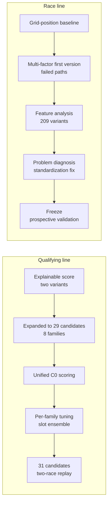
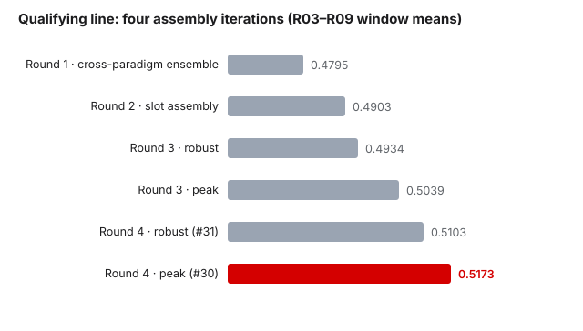
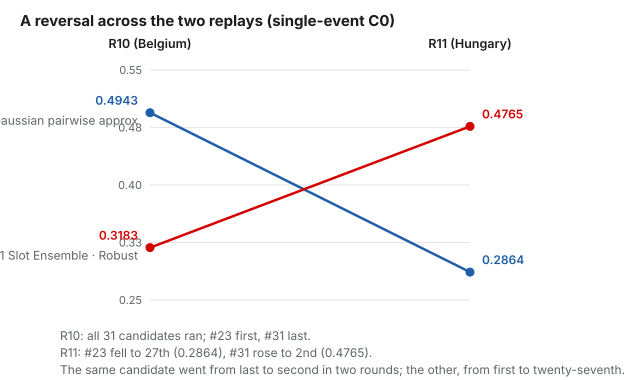
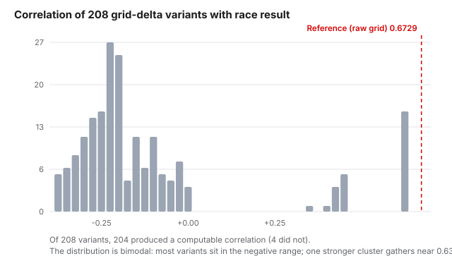
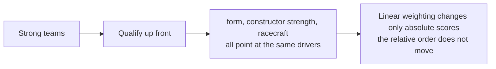
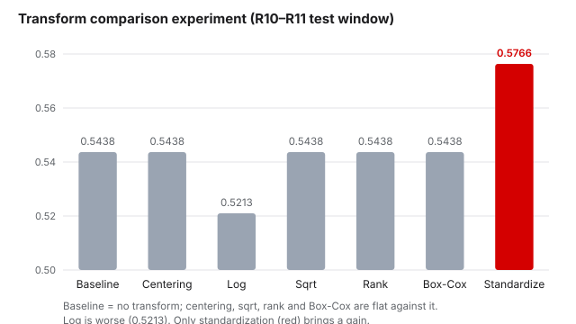
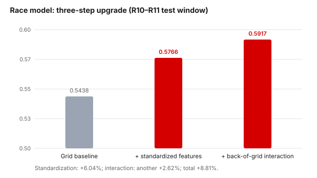

# 06 · Model Lineage

The chapters before this one covered methods; from here on, they cover models. Two independent model lines run in parallel in this project — the qualifying model and the race model. They never share parameters, and their ways of iterating differ completely: the qualifying line spread out a whole group of candidates in one move and let them compete under a single scoring standard; the race line set out from a minimal baseline, ran into a technical problem that disabled prediction partway, and then went through one repair chained to one round of validation, again and again. This chapter walks through both lines once more, on a timeline.

## 6.1 The Qualifying Line · Starting Point: The First Version and Two Variants

The first version of the qualifying model was simple: compute one total score per driver, line up all 22 drivers of the field by that score, and take the top ten as the prediction. Two clarifications. What "predict the top ten" narrows here is the scope of the task — the model still ranks the whole field internally; only the output and the scoring concern themselves with the top ten. As for the lap times and relative pole gaps promised in 1.3, they are not in this version: they belong to the lap-time layer planned later (Chapter 03), which did not exist yet.

The total score is a sum of five terms. Each term is first converted into a score between 0 and 1, and the five are then added with fixed weights:

- **Recent form (0.30)**: results from the three most recent qualifying sessions — each result converted into a number between 0 and 1 (first place close to 1, last place close to 0), then simple-averaged;
- **Constructor strength (0.25)**: the constructor's points in the standings, divided by the points of the leading constructor;
- **Circuit fit (0.20)**: historical qualifying results at the same circuit over the past five years;
- **Pre-race evidence (0.15)**: manually compiled public information from before the race, each item logged with its source and time (the method is in Chapter 04), converted into a score on the same scale;
- **Reliability (0.10)**: the finishing rate over the most recent races.

These weights came from the first-version implementation route settled on after the survey; they are a set of starting values — the survey report explicitly recommended adjusting them later with forward validation.

"Explainable" was not a slogan but three things that can be checked: take any driver's total score and it can be decomposed back into those five raw numbers; the weights sit in the open from start to finish and can be questioned and adjusted one at a time; and if a term lacks data (for instance, a round with no manually compiled evidence yet), that term is dropped and the remaining weights renormalized in proportion, with the gap recorded as it is — rather than a zero score passing for data.

What we originally planned was more than one version. Two choices inside the explainable score were left open: how to treat "pre-race evidence" (direction only, or a finer grading), and how to bring in the "track profile" (as an independent term, or by adjusting weights) — combined pairwise, four versions in name.

The "evidence treatment" comparison axis was abandoned quickly. The check turned up two things: the early pre-race evidence had left no proof that it was fixed before the race; and once the backtest handled evidence with time discipline, the two evidence-treatment modes produced identical outputs — a nominal comparison with no actual difference.

What actually survived were the two approaches on the track-profile axis:

| Variant | How the track profile participates |
| --- | --- |
| independent | The driver's historical results on similar circuits are computed as a term of their own and added to the total score independently |
| interaction | No separate term; instead, circuit type adjusts the weights of the other terms — on high-downforce circuits the "circuit fit" weight is multiplied by 1.25, and on street circuits the "reliability" weight is multiplied by 1.20 |

We backtested the two variants against the eight rounds then complete (rounds 2 through 9) — evaluation at the time still ran on the old metrics (they were retired in 6.3). This comparison could not answer the question we actually wanted to ask: the two variants come from the same idea, so comparing them can only settle which approach is better inside that one idea; to judge whether the idea itself is worth continuing, methods built on other ideas have to enter the comparison as well — otherwise "better or worse" has no reference.

That conclusion produced the next decision: implement as many of the methods collected in the survey as possible as candidates, so that models built on different ideas enter the same comparison. Not implementing all of them was deliberate — methods whose data was already in place came first (the P0 and P1 tiers of Chapter 03); methods that depend on new data pipelines (the lap-time layer, for instance) were left for later.

## 6.2 The Candidate Roster: 29 Candidates and 8 Families

The goal of this round was to make methods built on different ideas compete in the same arena, and the way to do it was to implement them all as candidates. The total eventually reached **29** — implemented and registered in batches over several days starting in mid-July. 4 of them come from the explainable score of 6.1: the two variants (independent and interaction), each carrying two weight sets — the starting weights from the previous section, and a tuned version.

The family composition and methods of the 29 candidates are as follows:

| Family | Count | Paradigm | Method |
| --- | ---: | --- | --- |
| Simple baselines | 4 | (pure controls) | No model; rank directly by a single signal — the previous round's result, the season-to-date standing, constructor order, last three rounds' form |
| Ridge regression | 2 | Regression | Regularized linear regression: regress a strength score for each driver and rank by it |
| Elastic Net | 3 | Regression | Mixed Ridge/Lasso regularization; also outputs a strength score |
| Explainable score | 4 | Heuristic aggregation | The two variants of 6.1 × two weight sets |
| Borda aggregation | 2 | Heuristic aggregation | Combine several ranking signals into one overall order (Borda count, introduced in Chapter 03) |
| Rating systems | 9 | Rating systems | Elo, Glicko, Massey, Colley, Keener, and others: infer strength from historical head-to-heads |
| Probabilistic models | 3 | Probabilistic models | Bradley-Terry, Plackett-Luce: model the probability that one driver finishes ahead of another |
| Learning-to-rank | 2 | Learning-to-rank | LambdaMART and the like: optimize ranking directly as the objective |

In total: 25 candidates spread over five paradigms (regression 5, rating systems 9, probabilistic models 3, learning-to-rank 2, heuristic aggregation 6), plus 4 simple baselines as pure controls. One thing to note: the role of the regression families here is not to predict lap times — they treat "finishing position" as the regression target, produce a strength score per driver, and rank on it; lap-time prediction belongs to the lap-time layer mentioned in 6.1, which had not been built at the time.

One caution when counting: candidates inside one family are often near-variants — the 4 explainable-score candidates differ only in weight sets, and the 9 rating-system candidates share much the same ideas. They cannot be counted as mutually independent models; the two replays in 6.4 demonstrate directly why this matters.

Implementation also turned up several errors, which we fixed; only the corrected versions entered the formal comparison:

- The update formulas for Elo, Glicko, and Plackett-Luce were wrong; each was checked and put right. All exploratory numbers from before the fixes were marked void and entered no formal conclusion;
- One candidate originally written up as "TrueSkill" was in fact a custom pairwise approximation, not the standard TrueSkill method (a well-known Bayesian rating system); it was renamed honestly as the "Gaussian pairing approximation", and its two configurations remain in the rating-system family.

One accounting note: round 2 has the least usable history, and the two learning-to-rank candidates need more training data before they can start, so they sit out that round. That is why the 230 in Chapter 05's "29 candidates × 8 rounds, 230 scoring opportunities in all" is 2 short of 29 × 8 = 232.

The complete list of the 29 candidates (names, families, parameters, and data requirements) is in Appendix C.

And one division of labor that still holds: models only produce predictions; C0 only scores a single prediction; comparison across races is a third, separate matter — the three are kept apart and never mixed (the freezing of C0 is in Chapter 05).

## 6.3 Unified Scoring and Tuning

In late July, all candidates began to be scored against one standard. Two old metrics were formally retired: mean absolute error (on average, how many places the predicted order differs from the true one) and NDCG (a generic ranking-quality score that weights the front positions more heavily) — both come from generic evaluation and were not designed for "a top-ten list, hit position by position" (Chapter 05 explains the problem with a single generic metric), so C0 replaced them. From then on the C0 mean (an equal-weighted average across rounds; it tops out at 1) was the only criterion, and the evaluation window was fixed at R03–R09.

The window's edges, for the record: R01 and R02 are outside it. R01 is missing part of the manually compiled data; R02 is where usable data starts, and the historical features have accumulated nothing at all — from R03 on, every prediction by every candidate finally has a comparable footing.

Next we tuned family by family. All 8 families had something adjustable, from the baselines' window length to the rating systems' smoothing parameter. The test of a "real gain" was leave-one-out validation (LOEO): hold out each of the seven rounds in turn and check whether the gain holds under every holdout. The result was that 7 of the families — every one except Elastic Net — produced no gain that stood up; Elastic Net's new configuration improved +0.0068, held on all seven folds, and was accepted.

One negative case is preserved in full: the Keener rating system at smoothing parameter α=0.10 looked like a gain of +0.0139, but taken apart, almost all of it came from the single round R08, and after leave-one-out it no longer reproduced — that is what overfitting looks like, and it was rejected.

The real change came from a lopsided tuning result: set the "circuit fit" weight of the interaction variant of the explainable score to 0.35, and the overall score is only 0.4263 (single candidates topped out around 0.47 at the time, so this sat mid-to-low) — yet the Top5 hit rate reached 0.800. It was weak in the other position segments and strong in the P4–P5 band. If a candidate can be strong in one local segment, could different candidates each take charge of the position segment they are strongest at?

This is the slot ensemble by position segment: every candidate already outputs a complete ordering of the field; assembly cuts it into position segments and takes, within each segment, the order of the corresponding candidate — P1–P3 from Elastic Net's order, P4–P5 from the tuned result above, P6–P10 and the internal order from the tuned explainable score. The assembly scheme went through four iterations, the score stepping upward each time (all seven-round means): 0.4795 → 0.4903 → 0.4934 and 0.5039 → the two final versions, **0.5103 and 0.5173**.

*Figure: the four iteration scores of the assembly scheme (seven-round window means).* "All seven leave-one-out folds positive" means: hold out each round of the window in turn, and the assembled version is no lower than the strongest single candidate up to then (around 0.47) under every holdout.

The two final versions differ only in how the stitching order is handled: the robust version returns the same result under both orders, the peak version holds under only one of them — they represent two orientations, "stability" and "ceiling", so both stayed on the roster for further testing. Two things must be said: the ensemble's components were picked and measured on this same window, and "all seven folds positive" tests stability — it is no substitute for unseen data; and the assembled versions are combinations of components drawn from the 29 candidates, so they are not independent of their source candidates — keep both points in mind when reading their results.

The two final versions joined the roster as #30 and #31 — the qualifying candidates went from 29 to 31.

## 6.4 Two Replays: How the 31 Candidates Actually Performed

In late July, development and tuning on R03–R09 came to a close, and testing moved out of the window. Two consecutive race weekends happened to fall right then (R10 Belgian, R11 Hungarian), and we ran two "replays" of all 31 candidates.

Their nature, stated first. A replay is a simulation run after the race, not a prediction published before it — each round is rerun using only data from before that round, so there is no way to peek at the result; but neither are they "bets actually placed at the time". A true pre-race blind test had to wait until the weights were frozen (6.8). Also, replay scores are single-race C0, a different measure from the seven-round means of 6.3: they support race-by-race comparison only and cannot be set directly against a window mean. As for the relation between the window and the rounds: R03–R09 is the window used for tuning and selection, and it is never added to; races from R10 onward are classified separately as out-of-window evidence — this section is its first use. All of this is to avoid "adjusting the window after seeing the results" (04.2).

**R10 (Belgian)**: all 31 candidates ran to completion with zero errors. The single-race high was 0.4943, from the Gaussian pairing approximation (#23, a rating model that infers driver strength through pairwise comparisons), against a field-wide median of 0.4060. One collective judgment was borne out: 17 candidates put Antonelli on pole — and pole that race was indeed his. But no candidate hit the top ten in full: 9 hit 9/10, and 12 hit 8/10.

**R11 (Hungarian)**: the high switched to equal-weight Borda (0.4790) — one of Borda's two configurations, which merges four ranking signals into one overall order at equal weights; the median that race was 0.3848. One shape is worth noting: the lowest score in the field was -0.0266, from #3 (the simple baseline that orders by constructor alone) — C0 can fall below 0, because the exact-position segment carries distance penalties, and a candidate that is almost entirely wrong is docked into negative territory. The race also exposed a shared blind spot: all 31 candidates missed Hulkenberg, who actually finished P10, and 21 put Lawson — actually P11 — into their top ten.

The key readings of the two races, side by side:

| Race | High | Median | Low | Distinct orderings |
| --- | --- | --- | --- | --- |
| R10 (Belgian) | 0.4943 (#23) | 0.4060 | 0.3183 (#31) | 17 |
| R11 (Hungarian) | 0.4790 (#14) | 0.3848 | -0.0266 (#3) | 19 |

*(Measure note: this table records the readings as taken in the two July replays; both rounds were later recomputed under unified conditions, and the formal citation is the first note of 7.3.)*

Laying the two races over each other, the most informative thing is a pair of reversals:

- R10's winner (Gaussian pairing approximation #23, 0.4943) fell to 27th in R11 (0.2864);
- R10's last-place candidate (#31, the robust slot ensemble by position segment — one of the two highest in-window scores in 6.3) rose to 2nd in R11 (0.4765).

The same candidate went from last to second in the space of two races; the other, from first to twenty-seventh.

*Figure: score trajectories of the two candidates across the two replays (single-race C0).* We never computed a formal fluctuation band for single-race scores, but the size of these reversals — the same candidate differing by more than 0.15 across two races — already says that the noise of single-race comparison is enough to swallow real differences between models. That is exactly the position staked out in 04.4, now demonstrated by real data.

There is also a structural reason. The 31 candidates overlap heavily in underlying data, ideas, and families (6.2); comparing their predicted top-ten lists against one another yields only 17 (R10) and 19 (R11) distinct orderings — 31 candidates are not 31 independent voters, and much of their error is shared. "Who scored higher across these two races" is therefore weaker still as a basis for a choice.

Finally, the state of selection at this point: the qualifying line had not chosen a "single entrant" — all 31 candidates were kept, to be tested further by later races; the two slot ensembles with the highest scores (#30, #31) were the decision priorities of the moment, and their story continues in Chapter 7. The complete single-race scores of all candidates in these two races are in Appendix C.

## 6.5 The Race Line · Prehistory: The Baseline and Two Failed Paths

Telling the race line's story means starting with what came before it. The project's earliest model was one monolithic architecture — iterated through seven or eight versions in a row, with all four prediction targets sharing a single set of parameters and features. By early July the structure had stalled. We once ran an automated parameter search that swept 4163 candidate combinations over eight rounds of data; every "circuit similarity" variant was rejected, and the final conclusion was that this old structure could not be the starting point for the new research. (Seen against the standards set down later, a sweep of that scale over old data carries overfitting risk in itself.)

More important than the failed search was a second lesson: one set of global parameters can hardly serve four prediction targets of different natures at once — sprint races and races simply need different features. These two lessons led directly to the mid-July structural rebuild: the four targets made independent of one another, each restarting from a clean baseline, and the old model replaced wholesale.

After the rebuild, the race line began from the most minimal baseline: order directly by grid position. "Grid position" here means the actual starting order — the race model runs after qualifying ends and before the race starts, receives the freshly set starting order, and predicts the race result. The baseline hardly looks like a model, yet it is hard to beat: the correlation between the race top ten and grid position is naturally very high (the rank correlation between grid position and finishing order is about 0.67; the full analysis is in 6.6). Its mean score across the two test races (R10–R11, the race line's own C0 measure) was **0.5438** — and every later effort only lifted it to 0.5917 (+8.8%, same measure; the process in 6.7).

Between the baseline and the final model, our first multi-factor attempts failed twice, and both are recorded as they happened.

The first: the key names for reading features were wrong. Data comes in as structures with field names (like the column names of a table); with the keys wrong, what gets read is an empty column — that version was nominally a multi-factor model, but not a single feature actually took part. Only after this was diagnosed did the model use features for the first time.

The second: feature weights were hardcoded into the code. It ran, but nothing could be searched and no alternative could be compared against it; it became an obstacle the moment we tried controlled experiments, so we made the weights configurable.

Neither attempt left scores on record — the scripts of the time printed results to the terminal and wrote nothing to disk. The later rule that every experiment must be written to disk and archived traces back to this experience. Both failures come down to the same lesson: get the data pipeline working first, then build the model — the key-name error was a pipeline problem, not a model problem.

## 6.6 Feature Analysis: 209 Variants and One Boundary

With the baseline in place and before multi-factor modeling began, we spent a week on a round of feature analysis (actually in late July; the two failed multi-factor attempts of 6.5 fall inside that same stretch — lessons first, analysis second, so that the causality reads cleanly). The boundary was drawn hard: **a single-factor correlation scan only — no modeling, no scoring runs**.

The object of the scan was the "grid delta" feature family: for every driver in every race, the difference between grid position and finishing position becomes a historical record — where a driver started, where he finished, and whether the amount above (or below) expectation was positive or negative. From it we built statistical variants under different measures — aggregation (mean, hit rate, and so on) × correction method × observation window — **208 variants** in all, plus one reference item (the raw grid position itself): 209 entries in total. For each entry we computed its correlation with finishing order (Spearman ρ: a coefficient of how alike two orderings are; 1 means identical). The reference item's value was **0.6729** — the predictive power of grid position itself. The full distribution falls into two clusters: most variants sit in negative territory, and a cluster of stronger variants gathers around **0.63** — none of them beats the reference item.

*Figure: the distribution of correlations between the 208 variants and finishing order; the red dashed line is the reference item.* The scan flagged risk warnings on 88 of the variants (small samples or sparse bins), and for 4 more no correlation could be computed; all of these demand extra care in interpretation. When these delta records are used, only past rounds enter — predicting a round draws only on records from before that round, and that round's own result takes no part (the forward constraint of 04.2).

The analysis left us with two things that mattered for later design.

First, it pinned down what "good" means: ranking high on correlation does not mean the score will improve — the two are different measures (Chapter 03 had flagged this early); the later criterion for choosing features therefore went back to the score itself, not to correlation rank. The scan's role stayed descriptive throughout: it yields no "optimal feature" verdict, and the gating (grid search, leave-one-out validation, an independent test window) was left to the modeling stage (6.7).

Second, a lead. One class of statistic goes by the name **racecraft** (the recovery-rate record) — the share of a driver's historical races in which his actual finishing order beat what the grid position implied. Its overall correlation is unremarkable, but split by position segment its behavior seems concentrated in the lower half of the field (grid P11 and beyond), and close to noise in the front range. We logged it as a lead to be verified: this feature may deserve a place in the "back of the grid", and none in the "top ten".

The lead posed the next design question directly: if recovery acts mainly in the back of the grid, can a correction be added to the predicted positions of back-of-grid drivers — giving the best recoverers a chance to squeeze into the top ten?

## 6.7 The Monotone-Transform Problem and the Fix

In early August, soon after race modeling began, one phenomenon kept recurring: add the qualifying-model family of features (recent form, constructor strength, and so on — 6.1) together with the new racecraft feature to the grid-position baseline, and the predicted top ten barely moved, no matter how the weights were tried.

**Diagnosis.** We ran correlation checks on 198 samples across R03–R11. The results: recent form (hereafter form) has a Pearson correlation coefficient of **-0.869** against grid position, constructor strength **-0.771**, racecraft **-0.531**, circuit fit -0.314; the pre-race-evidence term was 0 across this whole batch of data — the cause went unidentified at the time, and the question has stayed on the to-do list ever since; it has no variance and cannot take part in the computation. High correlation is not itself a bad thing; the problem is direction. Strong teams qualify and start up front — and form, constructor strength, and racecraft all score those same strong teams highly: every term is pushing the same set of drivers toward the same side.

Each driver's adjustment was therefore decided almost entirely by his grid position: about -2.8 at pole, about -1.0 at tenth (negative means a forward correction; the numbers are movements of score, not of position). There is a mathematical consequence here: if the adjustment varies monotonically with grid position — more push for those in front, less for those behind — then the new score is an order-preserving transform of the original grid position, and the ordering cannot change, however hard you push. A debug script confirmed it on R10 and R11: not one of the ten predicted positions changed. We later gave this class of phenomenon a name — "the monotone-transform problem": every correction stacks along the same monotone direction, so no new order can be produced. (A note on measure: the 6.6 scan measured the correlation of feature variants with finishing order; here it is the correlation of features with grid position — the objects differ.)

**Fix.** The way in was to change the features' unit: instead of raw scores, compute a mean and a standard deviation for each round, and restate each feature as "how many standard deviations from that round's own average":

$$ x_{\mathrm{std}} = \frac{x - \bar{x}}{\sigma}, \qquad \bar{x},\ \sigma\ \text{computed over the driver field of the current round; a term with zero variance is recorded as a standard score of 0} $$

σ sits in the denominator — so one and the same nominal weight moves the score less in rounds where the feature swings widely, and more where it swings little; before the transform, that influence was not consistent across rounds for the same weight. At the same time, drivers "above the round's average" are adjusted forward and those "below average" backward, and "everyone being high" no longer cancels out.

For the first time the effect showed up in positions, not just on paper: against the unstandardized version, 5 of the ten predicted positions changed hands in R10, and 6 in R11 (the driver occupying the same slot changed). One example: in R11, Antonelli started P7 with form and racecraft both about 1.5 standard deviations above that round's average, and was promoted to a predicted P5. Test-window score **0.5438 → 0.5766 (+6.04%)**.

A controlled experiment explains why only this one worked. The experiment held the weight values and the evaluation procedure fixed and changed only the transformation (same measure as this section's scores: the test window). Centering (subtracting the round's median) is a pure shift — equivalent to the original in ordering terms, with the score exactly flat at 0.5438. The log transform broke the shape of the signal and did worse (0.5213). Square root, rank normalization, and Box-Cox all stopped at 0.5438, matching the result of no transformation at all. Only the unit change of "divide by that round's standard deviation" actually moved the ranking.

*Figure: test-window scores of the seven transformations under one protocol.*

**Interaction term.** The lead left by 6.6 still owed a payoff: the racecraft kind of "recovery" signal was thought to work only in the back of the grid. We systematically tested 13 interaction forms across 4 major classes, scanning 9 weight levels for each independently (from -3.0 to +3.0). The four classes were multiplicative interactions (form × constructor strength, for example), field-wide grid interactions (grid × constructor strength, with no restriction by position segment), threshold interactions (grouping by strong team or not), and difference interactions (form − constructor strength). The only one that returned a positive gain was the simplest of them all — rear of grid × constructor strength:

$$ \text{boost} = \max(0,\ g - 10) \cdot c, \qquad \widehat{p} = g - 3.0\,f_{\mathrm{std}} - 2.0\,r_{\mathrm{std}} - 3.0\,\text{boost} $$

Notation: g is grid position; f_std and r_std are the standardized values of form and racecraft; c is constructor strength (raw value: the constructor's points divided by the points of the leading constructor, ranging from 0 to 1); p̂ is the score used for ordering, not the position itself. The term only takes effect from P11 onward (g minus 10 is zero at P10 and in front), so predictions at the front are left completely undisturbed. Its meaning can be said outright — "strong teams at the back will recover": starting from the same P15, a driver with constructor strength 0.8 gains a burst of (15−10)×0.8×3.0 in score, and one with strength 0.2 only (15−10)×0.2×3.0 (these are values inside the formula and cannot be converted directly into position changes; the actual effect is judged by the test-window score). Test-window score **0.5766 → 0.5917 (+2.62%)**. The reasons the other three classes were judged ineffective are on record as well: the multiplicative class carries no extra information once features are standardized; field-wide interactions break the structure at the front; the threshold class cuts too coarsely; and the difference class is already captured implicitly by standardization.

**The weight mix.** The final formula's three-term mix is form 3.0, racecraft 2.0, rear-of-grid interaction 3.0. The provenance has two layers: a grid search on the training window (R03–R09) first, then verification on the test window (R10–R11); and behind these three numbers sit three judgments — recent form matters more than recovery history (3.0 > 2.0); constructor strength does not enter the linear main term on its own (its information is already carried in bulk by form and racecraft, and the training-window search did not pick it as a standalone term); and the rear-of-grid interaction weighs the same as form. Read the mix with care: one 3.0 acts on a standardized feature (unit: standard deviations), the other 3.0 acts on c (unit: a strength value from 0 to 1); the two cannot be compared directly — actual strength speaks through test-window performance.

In total, **+8.81%** over the baseline (0.5438 → 0.5917).

*Figure: the three-stage lift from grid-position baseline to final model (test-window means).* Several limits, noted as they are: the percentages are the customary way to express relative gain — C0 has no natural zero (Chapter 05), and these comparisons make no claim of statistical significance (04.4); the test window holds only two races, and the overfitting risk has not been quantified; and the qualifying line's seven-fold leave-one-out validation was never replicated on the race line — the race line's protocol at the time was simply a fixed train/test split.

## 6.8 Freeze and the Prospective Phase

In the last week of late August, we froze the race model's weights in full — the very version that came out of the 6.7 fix.

From that moment the nature of testing changed. Until then, R03–R09 had been for tuning and R10–R11 for testing, and both were part of development: any decision made with them rested on the premise of having seen the data. Races after the freeze took part in no selection — the model was meeting them for the first time. We call this stage "the third window"; it has no set endpoint, and every race after the freeze counts (three rounds had been run at the time of writing), reported the same way as during development — per-round scores plus a running total (the numbers are in Chapter 07). The constructor-strength-correction blind test pre-registered in 3.5 (two trigger rounds) ran in parallel through this period; its triggers and verdicts are likewise recorded in Chapters 07 and 09.

R12 was the third window's first round. Facing data it had never seen, the model got the first four positions — names and order — entirely right (it moved Antonelli from the baseline's P3 up to P2, and the actual result was indeed P2), and finished ahead 0.6155 to the same-race baseline's 0.4614 (single-race C0 measure, not directly comparable with the two-race means of 6.5–6.7). The details are on record as they are: Hulkenberg climbed from P13 to P8 and Alonso from P18 to P9 — both finished inside the real top ten, but the push of the rear-of-grid interaction was not enough to carry them into the model's predicted top ten; and the model's predicted P7 went to Verstappen, who retired from that race, so the slot was bound to come up empty (drivers who fail to finish do not enter the actual-result comparison set) — a case of randomness no one could have foreseen. The readings from R13 and R14 follow in Chapter 07.

That the books could be kept this honestly rests on the freeze discipline: problems found after the freeze do not go straight into the model — a new idea first becomes an isolated experiment, and a major candidate then goes through pre-registered testing (04.6, Chapter 09); the narrowing of the gain observed at R14 was recorded exactly that way and set aside for later discussion.

How the qualifying line ran over the same period is a different story: it has no "single entrant" — all 31 candidates were kept and kept under test (6.4), and along the way it also ran into one scoring fault. Its readings and that fault unfold in Chapter 07. At this point the race line had entered its post-freeze prospective phase, and the qualifying line ran alongside it in the form of continuous candidate testing — the two lines' stories converge in Chapter 7.
