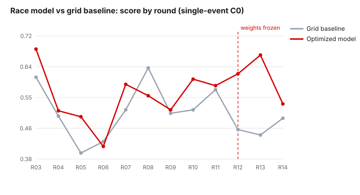
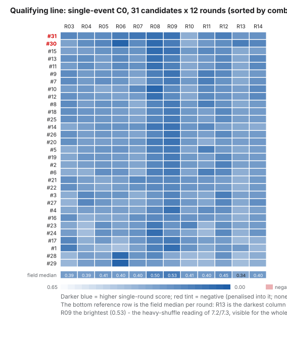
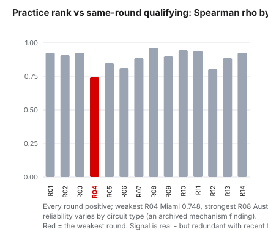
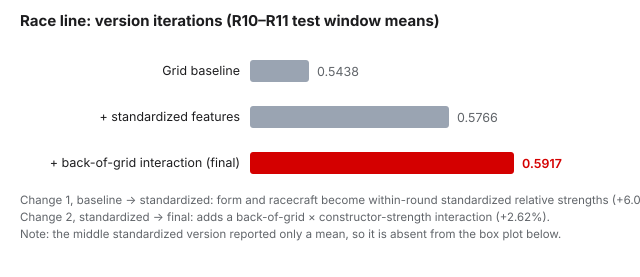
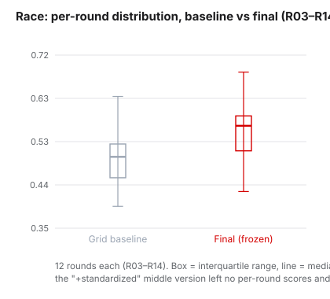
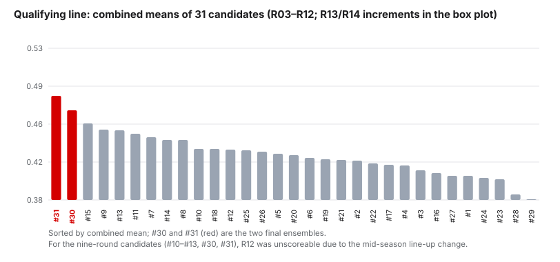
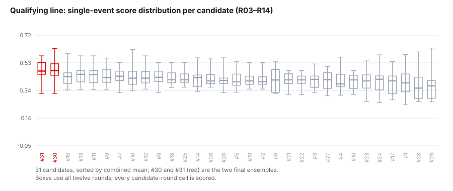

# 07 · Results

## 7.1 How to Read This Chapter

The preceding chapters recorded how the models were built; this chapter reports the readings. Two reading rules from Chapters 05 and 06 bear restating here in one place:

- **C0 measures how close a prediction came to the outcome**: it tops out at 1 and may go negative (below 0); it is not a win rate (Chapter 05). Scores are comparable only within the same basis — whether a number is a single-round score or a window mean, and which rounds it covers, is annotated alongside the number; single-round scores are noisy and are not used to judge model quality (04.4, 06.4).
- **When the evaluation happened**: every score in this chapter is a post-race evaluation of completed rounds — this research never released a prediction externally before a session; the fixed arrangement of publishing before a session begins only after this report is published.

One basis note covers every table and chart here: they all read the **official scorecards**, `c0_roster_r03_r14_92076830` (qualifying) and `c0_race_r03_r14_d739e6e0` (race), full R03–R14 recomputes under the seat-rotation policy of September 20 (decision log, entries 12 and 15), with the cleaned data behind them in `predictions/`. The readings that came earlier, the July replays and the September 18 merged scorecard, appear in the narrative as steps that led here rather than as competing tables. The data-driven charts have been regenerated on the same basis.

The chapter tells the two lines separately, as the last one did: **① the race line's full readings** (all twelve rounds, the post-freeze stretch, the error surface); **② the qualifying line's** (the 31-candidate scorecard, the in-window/out-of-window reading, the roster-change episode and its resolution); **③ one cross-line event**, the practice-signal experiment that both lines faced on the same day, told once, in its two-question form.

On the race side, the single-round score produces only the total (its scoring implementation is a simplified one, without per-segment detail), so race errors are presented as position-by-position comparison (7.2); the qualifying side's scoring output retains all per-segment detail (the Chapter 05 specification; omitted from the main text, indexed in Appendix C).

## 7.2 The Race Line: Twelve Rounds, One Table

The race model's readings over all twelve completed rounds are as follows (C0 single-round scores; the model is the optimized version described in 6.7, and the baseline sorts directly by grid position). First, the provenance. The early-August breakthrough evaluation printed its results to the screen only and never wrote them to disk (6.5 records that lesson); the September reruns persisted everything, reproducing the key numbers of the time: a first-seven-rounds model mean of 0.5380 and an R10–R11 two-round mean of 0.5918, against the 0.5380 / 0.5917 reported then (a last-digit rounding difference). Every round is computed under the forward constraint — each round's prediction uses only races before that round; the same holds for the baseline column. R12 onward are the post-freeze prospective rounds (6.8); R13 carries one correction explained below the table:

| Round | Event | Baseline | Model | Diff | |
| --- | --- | ---: | ---: | ---: | --- |
| R03 | Japan | 0.6060 | 0.6836 | +0.0776 | |
| R04 | Miami | 0.4986 | 0.5133 | +0.0147 | |
| R05 | Canada | 0.3967 | 0.4969 | +0.1002 | |
| R06 | Monaco | 0.4417 | 0.4283 | **-0.0134** | |
| R07 | Barcelona | 0.5160 | 0.5864 | +0.0704 | |
| R08 | Austria | 0.6317 | 0.5550 | **-0.0767** | |
| R09 | Silverstone | 0.5064 | 0.5160 | +0.0096 | |
| R10 | Spa | 0.5160 | 0.6007 | +0.0847 | |
| R11 | Hungary | 0.5717 | 0.5828 | +0.0111 | |
| R12 | Zandvoort | 0.4614 | 0.6155 | +0.1541 | post-freeze |
| R13 | Monza | 0.4464 | 0.5864 | +0.1400 | post-freeze |
| R14 | Madrid | 0.4928 | 0.5322 | +0.0394 | post-freeze |
| **Twelve-round mean** |  | **0.5071** | **0.5581** | **+0.0510** | |

*Notes. (1) The twelve-round mean mixes three kinds of window (tuning, test, and post-freeze) and is not meant for direct comparison against any single window's score — its role is an all-period reference. (2) The R06 (Monaco) actuals were corrected following an appeal ruling (the wording rule of 04.6; decision log, entry 9): the correction lifted both columns (baseline 0.4283 → 0.4417, model 0.4150 → 0.4283) and the round stays a loss. (3) R13's reading has one correction of its own, told just below.*

Across the twelve rounds the model won ten and lost two. No minimum-difference threshold is set for a "win", so +0.0096 also counts as a win. The count is descriptive, and the magnitude of single-round noise (6.4) means "ten wins, two losses" should not be read as a statistical conclusion. The two losing rounds deserve a separate look. **Monaco** (-0.013) is a street race: little room to overtake, few flips of the finishing order to begin with, and the baseline already close to the true order, so every nudge by the model was more likely a net loss. In **Austria** (-0.077) the baseline posted the season high of 0.6317, the same logic amplified. A loss is a loss; both rounds stand on record as they are.

*Figure: round-by-round scores for the race model and the grid-position baseline (R03–R14; from R12 onward these are prospective rounds under the frozen weights).*

**The post-freeze stretch: three wins, one correction.** The three rounds after the weight freeze (6.8) went 0.6155 / 0.5864 / 0.5322 against the baseline's 0.4614 / 0.4464 / 0.4928, a three-round mean of 0.5780 vs 0.4669, three wins in three, with uneven margins (+0.15, +0.14, +0.04). The largest margin has a concrete origin: at Monza, Antonelli was penalized to the back of the grid for a full power-unit change, the baseline had no place for the driver in its top ten, the model ranked Antonelli P1, and Antonelli won that race. The design assumption that "strong teams at the back will recover" (6.7) played out at Monza in its most extreme form.

The R13 reading carries the season's one substantive correction. The first run under the frozen weights gave 0.6672; the seat-rotation recompute (6.8) read Lawson's constructor term against Red Bull, the team he joined at R12, and the reading settled at 0.5864: the predicted top ten gained Lawson at P9 at the cost of arvid_lindblad (actually P8), while Lawson finished outside the top ten. The freeze held and no weight moved; what changed was the input contract, exactly where the roster did. The episode is the race-side face of the roster problem told fully in 7.3.

**The R14 (Madrid) margin narrowed, and we record it without embellishment**: +0.0394 is the smallest of the three gaps; under the freeze discipline, single-round movement is not grounds for changing weights, so the observation goes on record, to be revisited when more prospective rounds exist. The three-round baseline mean (0.4669) is also well below the season baseline mean (0.5071). These three races saw more shuffling of positions than a typical round, and the model's value lies precisely in "shuffle-heavy" races, so part of the stretch's outsized margin may come from that. A three-round sample supports no firm conclusion.

### The Error Surface: One Case Study and a Documentation Gap

**One case study: the full R12 breakdown.** Zandvoort scored well on the total (0.6155), and this time the total can be taken apart: the exact-position segment took 0.1800 on 4/10, the membership segment 0.2450 on 7/10, and the internal-order segment 0.1905 with 40/42 pairs consistent — the three segments combine to exactly 0.6155, reproducible by rerunning the frozen scorer (rechecked while writing this report). The shape of the error:

| Position | Model prediction | Actual result | Correct? |
| ---: | --- | --- | --- |
| P1–P4 | Norris / Antonelli / Russell / Hamilton | Norris / Antonelli / Russell / Hamilton | All correct |
| P5–P6 | Piastri / Leclerc | Leclerc / Piastri | The two swap positions |
| P7 | Verstappen | Lawson | Wrong |
| P8–P10 | Lawson / Lindblad / Bortoleto | Hulkenberg / Alonso / Gasly | All three wrong |

The scoring comparison is simple: the two lists are matched cell by cell, each cell judged once. The three errors each have their own cause. P5–P6 is a **slot misplacement**. Leclerc and Piastri both made the actual top ten (no list members lost), but the model put the two in each other's slots (predicted P5/P6, actual P6/P5). The P7 prediction was Verstappen, who retired from this race and is not in the official classification; the official P7 slot is Lawson, so that cell is judged wrong. (Lawson occupies P8 in the model's list, set against the official P8 Hulkenberg, which is another cell's error.) P8–P10 is the model's clearest systematic gap, **too little recovery thrust from the back**: Hulkenberg climbed P13 to P8, Alonso P18 to P9, Gasly P11 to P10, and all three made the actual top ten, while the model filled P8–P10 with Lawson, Lindblad and Bortoleto, so the names did not match. "How much thrust is enough" is not quantified (that requires first turning "recovery depth" into a scoreable quantity), and no new experiment targeting it has been run either; under the freeze discipline, if it is run, it goes through an isolated experiment with pre-registration first (6.8). In this round's total, exact position and internal order both sit near their ceilings, and the gap at the back is masked by the points earned at the front.

**A documentation gap, pinned down by code-tracing.** The first-version race model listed a "reliability" item in its feature spec and did read the value, but its combination formula distributed weight across four other items (recent form, constructor strength, circuit fit, pre-race evidence) and left none for reliability. Reliability therefore never actually took part in a race-line prediction; the August standardization rewrite (6.7) stopped reading it, which only made the fact visible. No explicit decision to drop it can be found in the session records, and the concrete account is a feature that, from the first version on, existed only on paper and quietly left the stage, rather than a working feature lost in the rewrite. The process gap it exposed is real: the feature spec said it was used and the formula did not use it, and nothing in the record flagged that inconsistency. The gap stays marked, and it connects directly to the Verstappen example above; had reliability ever actually entered the model, "who might retire" would at least have been part of the prediction's considerations. (The qualifying side's reliability feature is a separate story: declared in 6.1 at weight 0.10, it is in use there to this day, and its window was the one thing the seat-rotation recompute redefined, 7.3.)

**A cross-line note: what the practice signal did, and did not, mean here.** The same-week practice-signal experiment (told once, in 7.4) left one genuine discovery on the race line: the grid-anchored model systematically overestimates practice-fast drivers and teams (fleet residual ρ=-0.604), a corrective signal and the first of its kind either model has shown. It also left the discovery's limit: the correction converts to no score (+0.0006 at best). Both halves are part of this line's record.

With the readings told, one sentence closes the loop with 6.9: the racecraft source inside this model — chosen in August by correlation rank, frozen, and audited in September by a formula-slot ablation of all 204 sibling variants — finished first in that audit too. The table above is, as far as this research can currently tell, produced by the best of what was tried.

## 7.3 The Qualifying Line: The Scorecard, the Windows, and the Roster Episode

The qualifying line's official scorecard now covers R03–R14 for all 31 candidates — every cell scored, no exclusions. Sorting by combined mean, the top eight:

| Rank | Candidate | Combined mean (R03–R14) | Window (R03–R09) | Out of window (R10–R14) |
| ---: | --- | ---: | ---: | ---: |
| 1 | #31 Slot Ensemble · Robust | **0.4785** | 0.5144 | 0.4282 |
| 2 | #30 Slot Ensemble · Peak | 0.4749 | 0.5028 | 0.4358 |
| 3 | #15 Borda (constructor double-weighted) | 0.4400 | 0.4617 | 0.4095 |
| 4 | #13 Explainable score (independent, tuned) | 0.4392 | 0.4618 | 0.4077 |
| 5 | #11 Explainable score (interaction, tuned) | 0.4384 | 0.4603 | 0.4077 |
| 6 | #9 Elastic Net | 0.4372 | 0.4510 | 0.4180 |
| 7 | #7 Elastic Net | 0.4333 | 0.4390 | 0.4252 |
| 8 | #10 Explainable score (interaction, default) | 0.4296 | 0.4370 | 0.4193 |

*Provenance, in one place. This is the third version of the scorecard, and each version existed for a reason. The July replays (6.4) ran the candidates outside their tuning window for the first time. The September 18 merged rerun (entry 10) found and fixed an input gap, the circuit-history files for R10 onward being missing, so every candidate depending on that feature had been answering with one reference short; it also absorbed the R06 judgment revision the early-September run had predated. The September 20 recompute (entry 12) carried the seat-rotation policy: it redefined the reliability feature's window for the six feature-set candidates (three rounds → full season), moved their in-window figures slightly (#31 0.5103 → 0.5144), filled in every cell their absence had left empty, and left the 21 classical candidates' R03–R12 scores **bit-identical** (180/180 cells), the mechanism changing exactly what it claimed to. That same window change is also what separates these figures from the July replays of 6.4 on the two slot ensembles; the cause was traced after the fact and is recorded as entry 17. All numbers above and below read that final version; `predictions/qualifying/c0_matrix.csv` is its machine-readable form.*

Three readings need explanation. First, **the two windows tell the two ensembles apart**. #31 leads the tuning window at 0.5144 to #30's 0.5028, consistent with their construction (6.3), where #31 is the robust stitching and #30 the peak-chasing one. Out of window the order reverses: #30 posts 0.4358 to #31's 0.4282. The pair was kept on the roster precisely as "stability" and "ceiling" orientations, and over twelve rounds neither orientation has knocked the other out; they sit 0.0036 apart, with third place a further 0.035 back. Second, **the strongest classical candidates hold the middle**: the constructor double-weighted Borda (#15) leads all non-assembly candidates on the combined mean, and the two Elastic Net entries (#9, #7) are the steadiest across both windows. #7's out-of-window 0.4252 is the second-best in the whole column, with none of the assemblies' window sensitivity. Third, **out-of-window scores run below in-window scores across the board**: every candidate in the table drops from the first column to the second, by as little as 0.01 (the Elastic Nets) and as much as 0.09 (#31). Part of this is regression toward the mean after tuning on the window (the caution of 6.3); part is that R10–R14 contained harder rounds, R13 and R14 being heavy shuffles and the same rounds that kept the race line's baseline low (7.2). The two explanations are not separable on this sample, and the table does not try.

**The roster episode — the season's hardest scoring problem, and its resolution.** Around R12, one driver roster change set off three layers of knock-on effects, all recorded as they happened:

- **Cannot rank**: the six feature-set candidates (#10–#13 and the two assemblies #30, #31) build their predictions by walking the season-start registration list — Hadjar had stood down through injury, but on the list Hadjar still carried historical results, got scored, and landed in the top ten. Not scoring the round at all is what the scoring contract requires (a prediction containing a driver not on the entry list must raise an error; no silent substitution or proxy is allowed).
- **Invisible**: Tsunoda is not in the season-start scoring universe — no candidate built features for that seat, so none could predict the driver who filled it. When Tsunoda finished inside the top ten at R13, every then-scoreable candidate necessarily missed that seat (the membership-segment loss alone was about 0.035).
- **Mismatch**: Lawson switched to Red Bull — recent form and recovery history travel with the driver, but the "constructor strength" basis switched teams, and the aggregation semantics of constructor points drift across a switch.

Until September 20 the research kept the cost instead of patching it — "every score traceable end to end" outranked convenience (the ruling of entry 8, kept in 8.3's terms). The seat-rotation policy (entry 12) then replaced the blanket refusal with a mechanism, settled point by point: constructor-linked parameters follow the new team, driver-linked ones travel with the driver, whatever is neither stays put, and a fail-closed seat-event registry filters the slot assembly; the C0 scale itself was untouched. Both lines were recomputed in full, and the qualifying line's ledger reads: 372/372 candidate-round cells scored; the 21 classical candidates' pre-episode scores unchanged bit for bit; the reliability window ruling recorded as the sole in-window mover (#31 0.5103 → 0.5144).

The unlocked rounds immediately sharpen the picture. Over R13–R14, **#30 — the window's runner-up, silenced for three rounds — leads all 31 candidates at 0.5018** (R13 0.5196, R14 0.4839), with #31 back in the front group at 0.4240 (0.4160 / 0.4321); the classical candidates mostly sit between 0.30 and 0.40 in these two heavy-shuffle rounds. The episode's end state, three readings in one: the assemblies' ceiling claim survived its first out-of-window test, the mechanism's intervention is visible exactly where it claimed to act, and the practice-signal audit of 7.4 (entry 13) confirmed that no same-week source adds anything these candidates do not already have.

### Appendix: The Full Roster of 31 Candidates

The top-eight table covered only the leading part; the full picture of all 31 candidates in the registry follows (parameters are the configurations frozen at registration; the assembly details of #30, #31 are in 6.3; single-round C0 for every candidate on every round — all 372 cells scored — follows in the second appendix of this chapter):

| No. | Candidate | Family | Mechanism and key settings |
| ---: | --- | --- | --- |
| 1 | `latest_prior` | Simple baseline | Directly carries over the previous race's qualifying result |
| 2 | `season_to_date` | Simple baseline | Cumulative season-to-date qualifying positions |
| 3 | `constructor_only` | Simple baseline | Sorts by constructor only |
| 4 | `form_w3` | Simple baseline | Mean of the last three races' qualifying results only |
| 5 | `ridge_alpha_10` | Linear regression | Ridge regression α=10 |
| 6 | `ridge_alpha_5` | Linear regression | Ridge regression α=5 |
| 7 | `elastic_net_a020_l1_050` | Linear regression | Elastic net α=0.20, L1 ratio 0.50 |
| 8 | `elastic_net_a020_l1_070` | Linear regression | Elastic net α=0.20, L1 ratio 0.70 |
| 9 | `elastic_net_a001_l1_030` | Linear regression | Elastic net α=0.01, L1 ratio 0.30 |
| 10 | `explainable_interaction_default` | Explainable score | Track-type-adjusted weights · default configuration |
| 11 | `explainable_interaction_tuned` | Explainable score | Track-type-adjusted weights · tuned configuration |
| 12 | `explainable_independent_default` | Explainable score | Track profile as an independent term · default configuration |
| 13 | `explainable_independent_tuned` | Explainable score | Track profile as an independent term · tuned configuration |
| 14 | `borda_equal` | Borda count | Four ranking signals combined with equal weights |
| 15 | `borda_constructor_x2` | Borda count | Constructor signal double-weighted, the others equal |
| 16 | `elo_k16` | Head-to-head rating | Elo, K=16 |
| 17 | `elo_k32` | Head-to-head rating | Elo, K=32 |
| 18 | `massey` | Head-to-head rating | Massey least-squares rating |
| 19 | `colley` | Head-to-head rating | Colley least-squares rating |
| 20 | `keener_a025` | Head-to-head rating | Keener rating α=0.25 |
| 21 | `glicko_rd50` | Head-to-head rating | Glicko, initial uncertainty 50 |
| 22 | `glicko_rd150` | Head-to-head rating | Glicko, initial uncertainty 150 |
| 23 | `gaussian_pairwise_b417_t05` | Gaussian pairwise approximation | β=4.17, τ=0.5 |
| 24 | `gaussian_pairwise_b8_t0` | Gaussian pairwise approximation | β=8, τ=0 |
| 25 | `bradley_terry_delta0` | Probabilistic ranking | Bradley–Terry δ=0 |
| 26 | `bradley_terry_delta1` | Probabilistic ranking | Bradley–Terry δ=1 |
| 27 | `plackett_luce` | Probabilistic ranking | Plackett–Luce |
| 28 | `lambdamart_n100` | Learning-to-rank | LambdaMART, 100 trees |
| 29 | `lambdamart_n200` | Learning-to-rank | LambdaMART, 200 trees |
| 30 | `slot_ensemble_peak` | Slot ensemble | #9→P1 slot, #28→T3, circuit version→T5, #13→T10 and order (taken top-down) |
| 31 | `slot_ensemble_robust` | Slot ensemble | Elastic net→P1 and T3, circuit version→T5, #13→T10 and order (first come, first served) |

### Appendix: Single-Round C0 Detail, 31 Candidates × 12 Rounds

The table below is the complete data behind the box plots and the scorecard: each cell is the candidate's single-round C0 in that round, all 372 cells scored on the official caliber. The seat-rotation recompute filled the twelve cells the roster episode had left empty (7.3) and redefined the six feature-set candidates' reliability window, so those six rows differ from the pre-recompute basis; the 21 classical candidates' R03–R12 cells are bit-identical to it. One data note is kept on record: R14's qualifying archive itself carries only 20 rows, the upstream source being missing 2 cars, so the gap is in the data, not the scoring.

*Figure: the same 372 cells as color. Rows are the candidates in descending combined-mean order (#30, #31 in red); darker blue = higher single-round score, and the bottom reference row is the field median per round — R13's dark column (median 0.34) is the heavy-shuffle round made visible for the whole field, with R09 (0.53) the brightest. No cell falls below zero on the official caliber.*

| Candidate | R03 | R04 | R05 | R06 | R07 | R08 | R09 | R10 | R11 | R12 | R13 | R14 |
| ---: | ---: | ---: | ---: | ---: | ---: | ---: | ---: | ---: | ---: | ---: | ---: | ---: |
| #01 | 0.5241 | 0.3431 | 0.2847 | 0.2350 | 0.3748 | 0.5094 | 0.5860 | 0.4303 | 0.3388 | 0.4165 | 0.4004 | 0.2826 |
| #02 | 0.3446 | 0.3830 | 0.4131 | 0.3962 | 0.3564 | 0.4816 | 0.5298 | 0.4060 | 0.3786 | 0.5047 | 0.3758 | 0.3967 |
| #03 | 0.3206 | 0.4707 | 0.4232 | 0.4235 | 0.3184 | 0.4215 | 0.4931 | 0.3609 | 0.3431 | 0.5192 | 0.3704 | 0.4031 |
| #04 | 0.3446 | 0.3830 | 0.3778 | 0.3828 | 0.3555 | 0.4702 | 0.5673 | 0.3663 | 0.4543 | 0.4454 | 0.3024 | 0.3750 |
| #05 | 0.3236 | 0.3906 | 0.4232 | 0.4280 | 0.3756 | 0.5133 | 0.5349 | 0.3588 | 0.5127 | 0.4002 | 0.3389 | 0.3879 |
| #06 | 0.3236 | 0.3145 | 0.4491 | 0.4280 | 0.3184 | 0.5089 | 0.5349 | 0.3588 | 0.5127 | 0.4713 | 0.3174 | 0.3879 |
| #07 | 0.4629 | 0.3981 | 0.4491 | 0.4235 | 0.3208 | 0.4890 | 0.5298 | 0.4060 | 0.5127 | 0.4315 | 0.3389 | 0.4368 |
| #08 | 0.4629 | 0.3831 | 0.4305 | 0.4235 | 0.3208 | 0.4890 | 0.5298 | 0.4060 | 0.5127 | 0.4359 | 0.3389 | 0.4019 |
| #09 | 0.4629 | 0.3981 | 0.4232 | 0.4280 | 0.3711 | 0.5133 | 0.5601 | 0.3588 | 0.5127 | 0.4713 | 0.3389 | 0.4083 |
| #10 | 0.3896 | 0.4089 | 0.3326 | 0.3733 | 0.4708 | 0.6193 | 0.4647 | 0.3442 | 0.4678 | 0.4327 | 0.3794 | 0.4722 |
| #11 | 0.3896 | 0.4525 | 0.3883 | 0.4693 | 0.4392 | 0.5763 | 0.5069 | 0.3442 | 0.4032 | 0.4761 | 0.3427 | 0.4722 |
| #12 | 0.4423 | 0.4089 | 0.3898 | 0.3659 | 0.3970 | 0.5763 | 0.4647 | 0.3442 | 0.4678 | 0.4327 | 0.3794 | 0.4722 |
| #13 | 0.4423 | 0.4525 | 0.3883 | 0.4693 | 0.3970 | 0.5763 | 0.5069 | 0.3442 | 0.4032 | 0.4761 | 0.3427 | 0.4722 |
| #14 | 0.3416 | 0.3832 | 0.4319 | 0.4313 | 0.4317 | 0.5503 | 0.5624 | 0.4195 | 0.4742 | 0.3707 | 0.3389 | 0.3284 |
| #15 | 0.3739 | 0.3862 | 0.4319 | 0.4528 | 0.4317 | 0.5933 | 0.5624 | 0.4060 | 0.4727 | 0.4496 | 0.3389 | 0.3805 |
| #16 | 0.4453 | 0.3134 | 0.3461 | 0.3498 | 0.4392 | 0.4702 | 0.4743 | 0.4239 | 0.4158 | 0.3883 | 0.3069 | 0.4019 |
| #17 | 0.4849 | 0.3136 | 0.4092 | 0.2956 | 0.4126 | 0.5005 | 0.5358 | 0.4195 | 0.3848 | 0.3958 | 0.2699 | 0.3085 |
| #18 | 0.4513 | 0.4204 | 0.4131 | 0.3917 | 0.3564 | 0.4816 | 0.5298 | 0.4060 | 0.3786 | 0.4772 | 0.3758 | 0.3967 |
| #19 | 0.3446 | 0.4204 | 0.4131 | 0.3962 | 0.3564 | 0.4816 | 0.5298 | 0.4060 | 0.3786 | 0.4772 | 0.3758 | 0.3967 |
| #20 | 0.4438 | 0.3830 | 0.3828 | 0.3962 | 0.4141 | 0.5325 | 0.5624 | 0.4060 | 0.3202 | 0.4062 | 0.3818 | 0.4039 |
| #21 | 0.4453 | 0.3830 | 0.3461 | 0.3828 | 0.4738 | 0.4702 | 0.4743 | 0.4195 | 0.4158 | 0.3883 | 0.3069 | 0.4019 |
| #22 | 0.4453 | 0.3830 | 0.3461 | 0.3843 | 0.4317 | 0.4702 | 0.4743 | 0.4195 | 0.4158 | 0.3958 | 0.3069 | 0.4019 |
| #23 | 0.3461 | 0.2566 | 0.4432 | 0.3633 | 0.4053 | 0.5409 | 0.4263 | 0.4943 | 0.2864 | 0.4439 | 0.3535 | 0.3975 |
| #24 | 0.3902 | 0.2522 | 0.4388 | 0.3999 | 0.4355 | 0.5830 | 0.4338 | 0.3514 | 0.2687 | 0.4713 | 0.3026 | 0.4263 |
| #25 | 0.4453 | 0.4204 | 0.4131 | 0.3962 | 0.3579 | 0.4816 | 0.5298 | 0.4060 | 0.3786 | 0.4648 | 0.3758 | 0.3967 |
| #26 | 0.4378 | 0.3830 | 0.4131 | 0.3962 | 0.3579 | 0.4816 | 0.5601 | 0.4060 | 0.3786 | 0.4678 | 0.3758 | 0.3967 |
| #27 | 0.2978 | 0.4788 | 0.4131 | 0.3513 | 0.3461 | 0.4158 | 0.5023 | 0.4074 | 0.3505 | 0.4797 | 0.3433 | 0.4512 |
| #28 | 0.2792 | 0.3859 | 0.3622 | 0.6033 | 0.4231 | 0.4770 | 0.3405 | 0.2737 | 0.2699 | 0.4418 | 0.2586 | 0.3214 |
| #29 | 0.2822 | 0.3859 | 0.4050 | 0.6303 | 0.4187 | 0.4047 | 0.3714 | 0.2737 | 0.2773 | 0.3623 | 0.2556 | 0.3139 |
| #30 | 0.3682 | 0.4525 | 0.4837 | 0.6279 | 0.4646 | 0.5980 | 0.5246 | 0.3153 | 0.4076 | 0.4526 | 0.5196 | 0.4839 |
| #31 | 0.4789 | 0.4525 | 0.4583 | 0.5225 | 0.5502 | 0.5763 | 0.5624 | 0.3153 | 0.4614 | 0.5163 | 0.4160 | 0.4321 |

## 7.4 One Cross-Line Event: The Practice-Signal Experiment

The two lines ran on separate stories all season, and one event touched both at once. Racing fans ask it first: does the model read the practice sessions? The fact, verified entry by entry (decision log, entry 11), is that both models use zero practice data. The qualifying feature set was recent form, same-circuit history, constructor strength, circuit fit, track profile, pre-race evidence and reliability (the last component has since been removed, 6.10); the race formula runs on grid position, form, racecraft and the rear-of-grid interaction. The community splits on whether that is right, and in September the question was put to the test in a two-question form — *does the practice signal correlate with the outcome at all, and if so, does it add anything the model does not already know?* — asked in that order on both lines, with the scoring algorithm frozen before any model score was read (decision log, entries 13–14).

**Qualifying side: strongly correlated, nothing new.** Practice rank tracks same-round qualifying at ρ=0.886, positive in 14/14 rounds; sprint rounds improve 5/5 under a pooling fix (0.842 → 0.901), which entered the frozen algorithm. But the signal is redundant with recent form (overlap 0.876), explains essentially none of #31's prediction errors (ρ=-0.027), and all seven replacement ablations, the practice score swapped into recent form / constructor strength / circuit fit, alone or combined, 217 candidate-round cells, fell below the +0.010 bar, the only positive being +0.0072, inside the noise band. The qualifying feature line closed: the skeptics were right that practice adds nothing to the model; the side holding that the data had simply not been examined properly was right that the signal is real. It is information the model already had.

*Figure: per-round Spearman ρ between practice rank and qualifying result. Positive in all fourteen rounds; weakest at R04 Miami (0.748), strongest at R08 Austria (0.967) — the circuit-type stratification archived as a mechanism finding. Sprint rounds improve 5/5 under the pooling fix.*

**Race side: a real discovery, and its limit.** The correlation is weaker (driver version 0.661, fleet version 0.779; both 14/14) and the redundancy lower (0.578 against racecraft) — but the residual correlation is real: the grid-anchored model systematically overestimates practice-fast drivers and teams (residual ρ=-0.291 over 93 driver observations; -0.604 over 69 fleet observations), a corrective signal, the first of its kind either line has produced. The derived "gap" hypothesis — that grid position minus practice rank should predict race-day dropback through mean reversion — came out opposite to its framing: the race continues the qualifying-versus-practice deviation rather than reverting from it (pooled ρ=-0.2695 over 308 driver-rounds; at the extremes, drivers who paced fast in practice but qualified poorly dropped a further median 6 places, while grid overperformers gained 8). Still no conversion into score: re-ranking the frozen race order by the gap moved the R03–R14 mean by +0.0006, and weighting the practice score directly selected λ*=0. The race feature line closed on the same terms.

**The lesson, and the two lines' shapes of evidence.** Correlation is not C0 increment: the scale only responds near the top-ten boundary and at the front of the order, and both residual signals live where it is insensitive. Asking the correlation question first is what kept the answer cheap. And reading the two lines' results side by side remains the standing contrast of this chapter: the race line's evidence is a freeze and everything after it (three post-freeze rounds, one audit of its feature family); the qualifying line's is thirty-one candidates under continuous test, through a mid-season roster change and the mechanism that resolved it. Neither shape, on single-digit samples, licenses calling any model reliable (04.4) — both lines lay out what happened, as it happened.

## 7.5 The Limits of These Numbers

Every comparison in this chapter rests on single-digit to low-teens counts of race rounds (the 04.4 basis: the independent sample is the race), none sufficient to support any claim of being "significantly better". The race line's "ten wins, two losses" and "three wins in three" are descriptive statements, not proof of reliability, and the two counts cover different rounds: the twelve-round count is R03–R14, the three-win count is the post-freeze R12–R14, so R12 appears in both stretches. This research sets no "reliability line" either. 04.4 said so, and 7.4 repeats it: no declaration that "the model is reliable", and none that it is "unreliable". The judgment is a human ruling over all the evidence together (Chapter 09), and this report's task is to lay the evidence in order.

Where the open items recorded in this chapter go: **the narrowed R14 margin and the insufficient back-of-field thrust**, on record, to be revisited (the freeze discipline of 6.8); **the roster fault's mechanism is settled but young**, the seat-rotation policy having exactly one forward round behind it, with its longer record starting at R15; **the Madrid variable**, R14 being Madrid's first year on the calendar, so the "same-circuit history" feature line was absent across the board there, a structural gap for the qualifying candidates that depend on it (the race formula does not include that item, so its direct exposure is limited), to be re-evaluated when more "first running" rounds exist (when such a round appears is not ours to decide). The positive readings (R13's extreme recovery caught, R12's perfect top four, #30's unlocked R13–R14 lead) do not enter the "where things go" list, because they need no follow-up action; they are in the record, awaiting the natural test of more rounds.

Before entering the discussion of Chapter 08, 7.6 first puts the full picture of the two lines together for a look.

## 7.6 The Full Picture: Versions and Candidates

Before the discussion, the full picture of both lines, side by side.

**The race line: a three-step ladder of versions.** On the test window (R10–R11), the scores of the three versions form a three-step ladder:

*Figure: version iteration on the race line. The chart's annotation states each generation's change points; the middle, standardized version reported only a mean and left no round-by-round scores.*

The round-by-round distributions of the baseline and the final version, side by side (12 rounds each, R03–R14):

*Figure: round-by-round distributions for the baseline and the final version. The final version's median and interquartile range sit above the baseline's as a whole.*

**The qualifying line: all 31 candidates.** In descending order of combined mean:

*Figure: combined means of the 31 candidates; #30, #31 (in red) are the two final assembly versions, their configurations in 6.3.*

*Figure: each candidate's single-round score distribution over R03–R14 (all candidates score on all rounds on the official caliber); the box is the interquartile range, the center line the median, the whiskers the extremes.*

Two reading notes for the charts. First, the top of the qualifying line has a clear break: #31 and #30 (0.4785, 0.4749) lead third place by about 0.035, and as 7.3 said, the pair's order flips between the windows (#31 inside, #30 out), so read the charts with that in mind. Second, in the lower half of the box plots some candidates' distributions extend below 0, because C0 may go negative (the reading rule of 7.1; one concrete instance is R11, where the constructor-only #3 took -0.0266, 6.4).

The two full pictures end here; the limitations, work in flight, and open questions they raise are all in Chapter 08.
